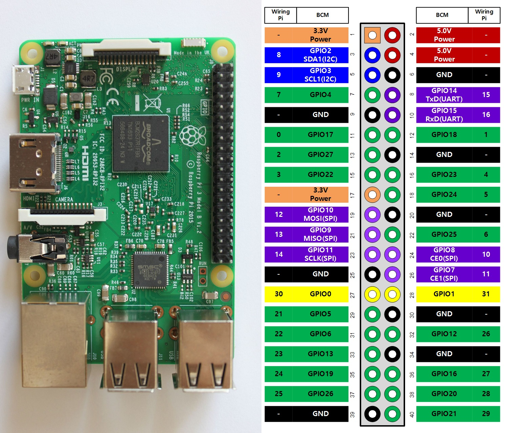

# NixOS router

## Hardware

- Raspberry Pi Compute Module 4
- [Waveshare CM4-DUAL-ETH-MINI](https://www.waveshare.com/wiki/CM4-DUAL-ETH-MINI)

## Build initial SD-card image

```bash
nix build .#raspi-image
```

## Initial flashing

1. Put the switch to the **LEFT** position (away from the USB port).
2. Run `sudo rpiboot`
3. Press the reset button
4. Verify the Pi is mounted, e.g. with `lsblk`
5. Flash image with: `sudo rpi-imager --cli ./result/sd-image/raspi-image-*-aarch64-linux.img /dev/sdb`

## Update config

Instead of flashing a new image once you have a NixOS system running use this to
rebuild/update the config

```bash
nixos-rebuild switch --flake '.#nixos-router' --target-host 'root@192.182.X.X' -L
```

## Debugging

The Raspberry Pi is configured to provide a TTY via serial on the GPIO pins 8
and 10 (WiringPi numbers 15 and 16) with 115200 baud speed.



Connecting a UART adapter should yield a console allowing you to log in. E.g.
with:

```sh
minicom -D /dev/ttyUSB0 -b 115200
```
